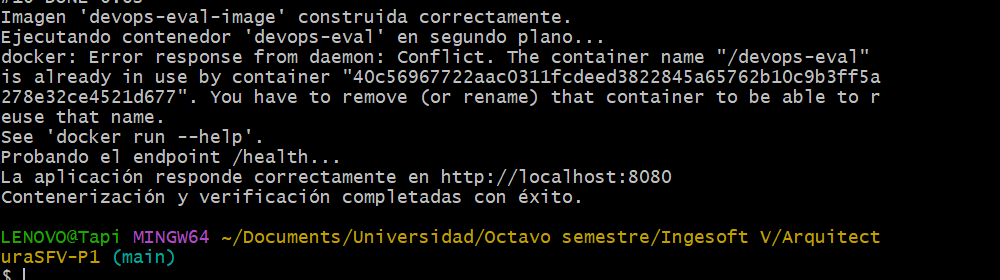

# ArquitecturaSFV-P1

# Evaluación Práctica - Ingeniería de Software V

## Información del Estudiante
- **Nombre:Valentina Gonzalez**
- **Código: A00394152**
- **Fecha: 5/08/25**

## Resumen de la Solución
Esta solución contiene una pequeña aplicación Node.js con un endpoint /health que responde con OK. La aplicación fue contenerizada usando Docker y automatizada con un script bash (run.sh) que construye la imagen, corre el contenedor y verifica que el endpoint esté funcionando correctamente.

El objetivo fue aplicar principios de DevOps como automatización, consistencia y portabilidad, asegurando que la aplicación pueda ser ejecutada y validada de forma sencilla en cualquier entorno con Docker.

## Dockerfile
Para el Dockerfile utilicé la imagen base node:20-alpine por ser ligera y adecuada para entornos de producción. Algunas decisiones clave:

- Usar WORKDIR para tener una estructura de carpetas limpia dentro del contenedor.
- Copiar solo los archivos necesarios (package*.json) primero para aprovechar el cache de Docker en el paso de instalación de dependencias.
- Ejecutar npm audit fix --force para corregir posibles vulnerabilidades automáticamente.
- Exponer el puerto 8080, usado por la app, y definido por una variable de entorno (PORT).

## Script de Automatización
El script run.sh automatiza todo el flujo de ejecución. Las funcionalidades que incluye son:

1. Verifica si Docker está instalado.
2. Construye la imagen Docker con docker build.
3. Ejecuta el contenedor en segundo plano (docker run -d) con las variables de entorno necesarias.
4. Espera unos segundos y luego hace una prueba al endpoint /health usando curl.
5. Muestra mensajes personalizados de éxito o error según el resultado.
6. Muestra los logs del contenedor si algo falla, y lo detiene automáticamente.

Esto permite verificar que todo funciona correctamente con un solo comando.

## Principios DevOps Aplicados
1. Automatización del flujo de desarrollo: desde la construcción hasta la prueba de la app.
2. Consistencia entre entornos: gracias al uso de Docker, la aplicación se comporta igual en cualquier máquina.
3. Feedback inmediato: mediante la validación del endpoint /health, se puede detectar rápidamente si algo salió mal.

## Captura de Pantalla

## Mejoras Futuras
1. Implementar pruebas unitarias automatizadas antes de construir la imagen.
2. Configurar un pipeline CI/CD para integrar esta solución con GitHub Actions o GitLab CI.
3. Permitir más endpoints en la aplicación y validar su respuesta desde el script automáticamente.

## Instrucciones para Ejecutar
1. Asegúrate de tener Docker instalado en tu máquina.
2. Clona este repositorio.
3. Asigna permisos de ejecución al script si es necesario: chmod +x run.sh
4. Ejecuta el script: ./run.sh
5. Si todo funciona correctamente, deberías ver un mensaje indicando que el endpoint /health responde correctamente.

